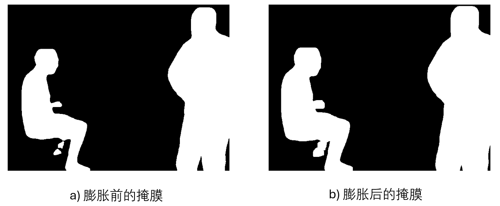

# 掩膜膨胀法

# 代码

```python
import cv2
import numpy as np

# 读取图像
image = cv2.imread('1341846313.922055.png', cv2.IMREAD_UNCHANGED)

# 确认图像已正确读取
if image is None:
    print("图像文件未找到或无法读取。")
else:
    # 创建膨胀用的核
    kernel_size = 10  # 核的大小可以根据需要调整
    kernel = np.ones((kernel_size, kernel_size), np.uint8)

    # 应用膨胀操作
    dilated_image = cv2.dilate(image, kernel, iterations=1)  # 迭代次数也可以根据需求调整

    # 显示原始图像和膨胀后的图像
    cv2.imshow('Original Image', image)
    cv2.imshow('Dilated Image', dilated_image)
    cv2.waitKey(0)
    cv2.destroyAllWindows()

    # 如果需要，可以保存膨胀后的图像
    cv2.imwrite('dilated_1341846313.922055.png', dilated_image)

```

## 结果


